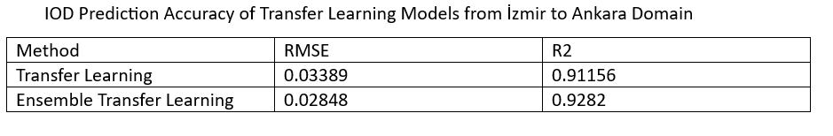
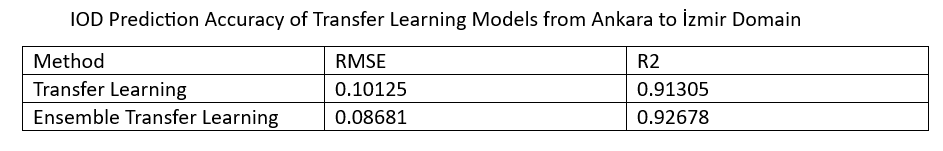
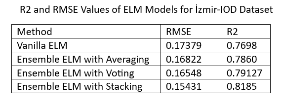

# Transfer Learning and ELM for IOD Prediction  

# **Contents**  
  * config.py: Contains the hyperparameters to be determined by the user, including which model to execute  
  * execute_code.py: Executes the model selected in the config.py file when called  
  * models: A folder that contains the models  
  * datasets: A folder that contains the datasets used while constructing the models (The hyperparameters that were used for these datasets are given below)  

# **Models**  
  * transfer_learning.py: A transfer learning model for regression that uses mini-batch gradient descent, cyclic LR decay and recursive feature elimination  
  * en_transfer_learning.py: An ensemble transfer learning model that trains base models on different parts of the source data and combines them using weighted average  
  * Vanilla_ELM.py: An Extreme Learning Machine model   
  * ENELM_Averaging.py: An Ensemble Extreme Learning Machine model that uses averaging  
  * ENELM_Voting.py: An Ensemble Extreme Learning Machine model that uses voting  
  * ENELM_Stacking.py: An Ensemble Extreme Learning Machine model that uses stacking  
 
# **Config**  
-   self.transfer: If the model to be run is a transfer learning model ("yes"/"no")  
-   self.selected_code: The model to be executed ("transfer_learning.py"/"en_transfer_learning.py"/"Vanilla_ELM.py"/"ENELM_Averaging.py"/"ENELM_Voting.py"/"ENELM_Stacking.py")  
-   For transfer learning models  
    -   self.epochs_a: Number of training epochs for source domain  
    -   self.epochs_b: Number of training epochs for target domain  
    -   self.hidden_size: Size of the first layer of the MLP (Size of the hidden layers decrease by 5 until the output)  
    -   self.batch_size_a: Batch size for mini-batch GD for source domain  
    -   self.batch_size_b: Batch size for mini-batch GD for target domain  
    -   self.weight_decay_a: Weight decay for source domain optimizer  
    -   self.weight_decay_b: Weight decay for target domain optimizer  
    -   self.base_lr_a: Min learning rate for CyclicLR for source  
    -   self.max_lr_a: Max learning rate for CyclicLR for source  
    -   self.base_lr_b: Min learning rate for CyclicLR for target  
    -   self.max_lr_b: Max learning rate for CyclicLR for target  
    -   self.num_features_to_keep: Number of features to keep in recursive feature elimination (Max value is 25)  
    -   self.source_data: Source domain data file name (String)  
    -   self.target_data: Target domain data file name (String)  
    -   self.num_of_bases: (Only for en_transfer_learning) Number of base models  
-   For ELM models  
    -   self.data: Data file name (String)  
    -   self.hidden_size: Size of the ELM hidden layer  
    -   self.model_count: (For the ensemble models) Number of base models  
    -   self.hidden_size_final: (Only for ENELM_Stacking) Size of the hidden layer of the ensembling ELM  
    -   self.round_to: (Only for ENELM_Voting) The nearest point to round the predictions to   
          
# **Usage** 
  * wandb and openpyxl should be installed  
  * Open the config.py file and set the parameters  
  * Run the command "python execute_code.py"  

# **Hyperparameters for the datasets "izmir_iod_dataset.xlsx" and "ankara_iod_dataset.xlsx"**    
  * transfer_learning (source=izmir, target=ankara): self.epochs_a=200, self.epochs_b=200, self.hidden_size=20, 
     self.batch_size_a=300, self.batch_size_b=150, self.weight_decay_a=0, self.weight_decay_b=0, self.base_lr_a=0.0002, 
     self.max_lr_a=0.009, self.base_lr_b=0.004, self.max_lr_b=0.05, self.num_features_to_keep=25  
  * transfer_learning (source=ankara, target=izmir): self.epochs_a=300, self.epochs_b=100, self.hidden_size=20, 
     self.batch_size_a=300, self.batch_size_b=300, self.weight_decay_a=0, self.weight_decay_b=0.0007, 
     self.base_lr_a=0.0008, self.max_lr_a=0.009, self.base_lr_b=0.009, self.max_lr_b=0.035, self.num_features_to_keep=25  
  * en_transfer_learning (source=izmir, target=ankara): self.epochs_a=200, self.epochs_b=200, self.hidden_size=20,
     self.batch_size_a=300, self.batch_size_b=150, self.weight_decay_a=0, self.weight_decay_b=0, self.base_lr_a=0.0002, 
     self.max_lr_a=0.009, self.base_lr_b=0.004, self.max_lr_b=0.05, self.num_features_to_keep=23, self.num_of_bases=8  
  * en_transfer_learning (source=ankara, target=izmir): self.epochs_a=300, self.epochs_b=100, self.hidden_size=20, 
     self.batch_size_a=300, self.batch_size_b=300, self.weight_decay_a=0, self.weight_decay_b=0.0007, 
     self.base_lr_a=0.0008, self.max_lr_a=0.009, self.base_lr_b=0.009, self.max_lr_b=0.035, self.num_features_to_keep=24, 
     num_of_bases=5  
  * Vanilla_ELM (data=izmir): self.hidden_size=48  
  * ENELM_Averaging (data=izmir): self.hidden_size=47  
  * ENELM_Voting (data=izmir): self.hidden_size=60, self.model_count = 4, self.round_to = 0.02  
  * ENELM_Stacking (data=izmir): self.hidden_size=60, self.model_count = 4, self.hidden_size_final = 67  
  
# **Results**  
  

  
 
  

